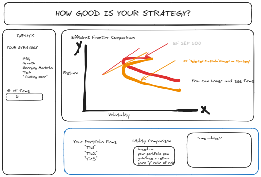

# Portfolio Utility: A Comparative Analysis    
### The Research   
Are you an active investor? Have you ever tried to position your portfolio towards a specifc area to "maximize" your portfolio? If you have, this repo will teach you a valueable lesson: diversification rules!  
This project aims to assess the utility of a given portfolio theme (i.e., sustainability, low beta, sector specific investing, etc.) when compared to a larger sample benchmark (the S&P 500 in this case). At large scale (the big question), research in this repo aims to validate the marginal utility of increased diversification, by showing compromises in utility in a given subset of the larger sample. Essentially, how much utility do you sacrifice by restricting your portfolio to a given theme of securities?  
The dashboard in this project is based off of a previous dashboard in professor Don Bowen's "Data Science for Finance" Course, found here:(https://github.com/donbowen/portfolio-frontier-streamlit-dashboard). Our project builds on this dashboard by providing insight into the effect of portfolio themes. It deviates from the previous project by eliminating the option for leveraged portfolios and providing a risk quiz; it rather shows the difference in utility between a population of securities and a subset at a arbitrarily selected level of risk aversion.  
***Official Research Question:*** How many utils are sacrificed/gained based by investing in a specifically themed portfolio?   
**What it will look like**  
To visualize this, the project will create a dashboard that graphs the efficient frontier of a large sample (the S&P 500). Additionally, upon selection, the dashboard will then graph the efficient frontier of the subsample of the data based on a given portfolio theme. The themes will include:
 - Stability  
 - Technology  
 - Low Beta  
 - ESG Firms  
 - Firms headquartered in Pennsylvania  
 - Most expensive equities  
 - Cheapest equities  
 - Firms that create or deliver pizza i.e. Domino’s, Grubhub  
 - Tickers that contain the letters “L”, “E”, “H”, “I”, or “G”  
 - Etc.    

**The Analysis will then assess the following:**  
 - Which firms are included in the subset vs the benchmark?  
 - What is the marginal utility of the subset (assessed through the utility equation)  
 - Given different risk aversion levels (different points on the capital allocation line), how much more or less efficient does the subset become?  
 - Another ***potential*** area of interest for this dashboard could be providing explanatory insight into the above metrics over the course of time.  For example, how has the sustainability portfolio performed over the past five years as opposed to the prior five before that? How does the efficient set’s comparison to the benchmark change over time? Does time show trends of certain portfolio groups improving in utility?   
### The Data 
 - The final dataset used to perform an analysis will contain each firm and its return/variance over a given period of time.  
 - Dependent on adopting the time aspect of this model, the unit of observation will either be firm, or firm-time-period (i.e., 3yr CAGR foro 15 years of data).  
 - Sample period will depend on the adoption mentioned above, but at minimum will be a 1yr time from for which to compound returns over  
 - Sample restrictions will be made based on the listed portfolio themes, research into the categories will determine specific selections of firms.  
 - Data on returns, ticker, potential categorization values (i.e., ESG scores, beta etc.) are required and will likely need to be merged from multiple datasets. 
 - Raw data for all of the above is available, calculation of returns and variance will be required. This data will not be collected, rather computed off of raw data.  
 - Inputs will be return data and necessary thematic descriptors. Data will be stored as follows:   
### File Structure  
 - Get data: data including: ticker, price, beta, gsector, and esg score will be downloaded in a get data file, that will produce a finalized CV alonside a variance ovariance matrix.
 - Dashboard: a pytyhon file will be used to generate a dashboard that then performs all analysis including plotting, utility scoring and comparison, etc.
**Pseudo-Code Procedure**  

1. Import dataset (yfinance)
2. Potential merging required.
3. Output CSV
4. In python file:
5. Import efficient fronteir and relevant packages
7. Define levels of risk aversion (create arbitrarily calculated, selectable levels of “riskiness rather than using an assessment)
9. Calculate Return and variance of each security over a specified time horizon
10. Subset firms into according portfolio groups
11. With risk aversion and user-selected goals, able to calculate capital allocation  
 a. Set aside percentage of capital for risk free assets 
 b. With equity section, continue to next step
13. Calculate efficient frontier curves for entire dataset as well as the user-selected goal-oriented dataset-trim
14. Calculate distances between firms in the trimmed-dataset and the benchmark frontier curve (variance covariance matrix)
15. Add highest ranked (closest) firms to frontier curve to optimal equity list based on a user-selected number of securities to include
16. Utility calculations: Using utility theory function to calculate the given utility score of a portfolio, compare utility score across portfolios to determine sacrifices/gains of a given portfolio.  
Utility Score Formula: U = E(r)-(1/2)A*o*^2 
17. Based on strategy, provide some commentary

### Sample of Dashboard

